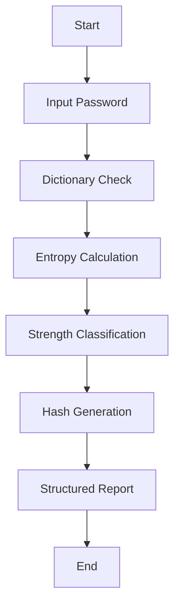
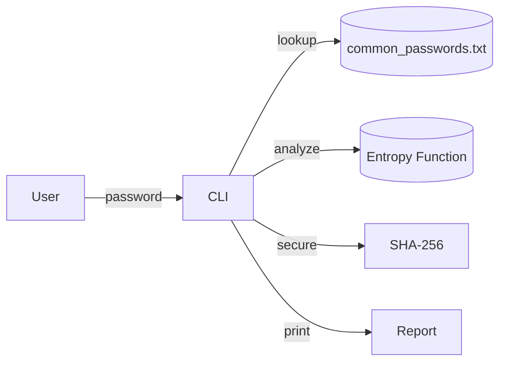
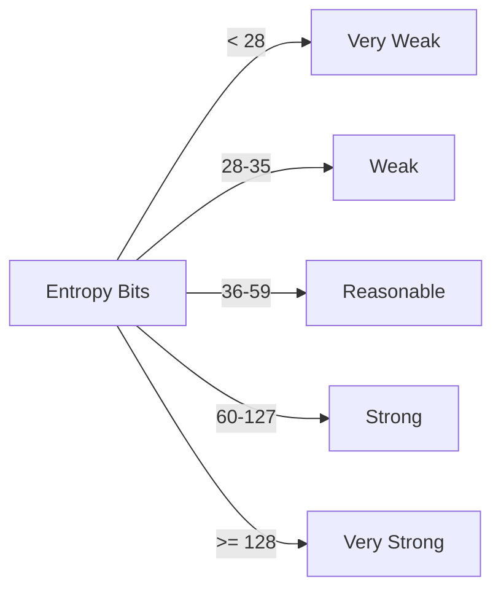

# Case Study 4: Password Analysis Tool & Policy Review

Student Name: Mohammad Aakib Bhat  
Department: Computer Science and System Engineering  
University: C.V. Raman Global University  
Course: Cybersecurity  
Instructor: [Professor’s Name]  
Date: [Insert Submission Date]

---

## Acknowledgment
I would like to express sincere gratitude to my instructor and the Department of Computer Science and System Engineering for their academic supervision, domain insights, and timely feedback during the planning and execution of this cybersecurity case study. I also acknowledge the contributions of the wider security community, whose open resources and guidance (OWASP, NIST) influenced the design and evaluation of this work.

## Abstract
This case study presents the design, development, and evaluation of a Python-based Command Line Interface (CLI) tool that analyzes password strength using dictionary checks, entropy calculations, and secure hashing. The work is situated in the context of modern identity and access management (IAM) risks where weak, reused, and compromised passwords remain a leading cause of account takeover. The study also delivers a professional organizational password policy aligned with NIST SP 800-63B recommendations. We provide a methodology, implementation details, diagrams, sample audit results, analysis, and improvement roadmap. The results demonstrate that the tool reliably flags dictionary-based passwords and correlates entropy with expected strength classes, enabling actionable policy enforcement in organizational settings.

## Table of Contents
1. Introduction  
2. Objectives  
3. Scope  
4. Tools and Technologies  
5. Theoretical Background  
6. Methodology and System Design  
7. Implementation (Python CLI)  
8. Sample Output and Audit Results  
9. Organizational Password Policy  
10. Results and Discussion  
11. Conclusion  
12. Future Enhancements  
13. References  
14. Appendix

---

## 1. Introduction
Passwords remain a primary mechanism for authentication across consumer and enterprise systems. Despite the rise of multi-factor authentication (MFA) and passwordless initiatives, human factors (memorability, reuse) and operational constraints keep passwords central to identity security. Adversaries exploit low-entropy and reused passwords via credential stuffing and dictionary attacks, often at massive scale using leaked datasets. 

This case study addresses these realities by delivering: (1) a practical Python CLI tool to analyze password strength using dictionary and entropy checks with hashing; and (2) a policy framework aligned to recognized standards to guide organizational adoption. Together, these outputs support secure password lifecycle management, user education, and audit-driven governance.

### 1.1 Problem Statement
- Users frequently select weak or predictable passwords.
- Organizations lack consistent tooling for rapid password auditing.
- Policies are often either too rigid (reducing usability) or too lax (lowering security), and not aligned with current standards.

### 1.2 Significance
A lightweight CLI tool paired with a standards-based policy enables rapid internal assessments, improves posture against credential-based threats, and promotes a culture of security by design.

---

## 2. Objectives
- Build a Python CLI tool to analyze password strength.  
- Detect dictionary-based (common/reused) passwords.  
- Compute entropy to quantify unpredictability and classify strength.  
- Hash passwords (SHA-256 baseline) to avoid plaintext exposure during testing.  
- Propose an organizational password policy aligned with NIST SP 800-63B and OWASP guidance.  
- Provide sample audit outputs and discuss operational implications.

---

## 3. Scope
- Focus: Single-machine CLI evaluation of passwords entered ad hoc or in batches (extension-ready).  
- Not in scope: Live integration with identity providers (IdPs) or directory services (addressed in Future Enhancements).  
- Assumption: Audits occur in a secure environment; password inputs are provided by authorized personnel for assessment.

---

## 4. Tools and Technologies

| Tool/Library | Purpose |
|---|---|
| Python 3.x | Core programming language and runtime |
| hashlib | Password hashing using SHA-256/512 for demonstration |
| math | Entropy calculations using log2 |
| rockyou.txt/custom list | Dictionary-based weak password checks |
| CLI (stdin) | Interactive interface for analysts |

Rationale: Python provides a succinct and auditable code path. While SHA-256 is used here for demonstration, production systems must use slow, salted password hashes (Argon2id, scrypt, or bcrypt) for storage contexts.

---

## 5. Theoretical Background

### 5.1 Password Security Fundamentals
Strong passwords maximize search space and resist guessing attacks. Attackers prioritize known weak lists and human patterns before resorting to pure brute force.

### 5.2 Entropy and Randomness
Password entropy estimates unpredictability:  
\[ H = L \times \log_2(N) \]  
where \(L\) is password length and \(N\) is the size of the character set used. While entropy is an approximation (it assumes independence of characters), it is a useful heuristic for comparative strength.

Classification (heuristic):
- < 28 bits: Very Weak  
- 28–35 bits: Weak  
- 36–59 bits: Reasonable  
- 60–127 bits: Strong  
- ≥ 128 bits: Very Strong  

### 5.3 Dictionary Attacks and Reuse
Dictionary attacks compare candidate passwords against curated lists (e.g., leaked datasets). Password reuse across systems dramatically increases risk from credential stuffing.

### 5.4 Hashing and Storage
Hashing converts passwords to fixed-length digests; salts prevent precomputed attacks. For storage, slow, memory-hard algorithms (Argon2id) are recommended; SHA-256 alone is insufficient for storage but can be used in controlled analysis workflows to avoid plaintext printing.

### 5.5 Standards Context (NIST/OWASP)
NIST SP 800-63B discourages arbitrary composition rules and periodic forced changes absent evidence of compromise, while encouraging breach database screening and usability-aligned strength meters. OWASP provides secure storage and implementation guidance.

---

## 6. Methodology and System Design

### 6.1 Process Flow (Figure 1)

Figure 1: End-to-end flow of password analysis steps in the CLI tool.

### 6.2 Data Flow (Figure 2)

Figure 2: Data flow among the input, dictionary store, analysis functions, and reporting.

### 6.3 Entropy Classification (Figure 3)

Figure 3: Mapping of entropy ranges to human-readable strength tiers.

### 6.4 Design Decisions
- Dictionary scanning is I/O bound; for large lists, streaming comparison avoids high memory overhead.  
- Entropy estimation assumes independent characters; additional heuristics can penalize sequential/repeated patterns.  
- Hash output is displayed for audit traceability without persisting raw passwords.

---

## 7. Implementation (Python CLI)

```python
import hashlib
import math
import os
from typing import Tuple

def calculate_entropy(password: str) -> float:
    charset = 0
    if any(c.islower() for c in password):
        charset += 26
    if any(c.isupper() for c in password):
        charset += 26
    if any(c.isdigit() for c in password):
        charset += 10
    if any(not c.isalnum() for c in password):
        charset += 32
    if charset == 0:
        return 0.0
    entropy = len(password) * math.log2(charset)
    return round(entropy, 2)

def check_dictionary(password: str, dict_file: str = "common_passwords.txt") -> bool:
    if not os.path.exists(dict_file):
        return False
    with open(dict_file, "r", errors="ignore") as f:
        for line in f:
            if password == line.strip():
                return True
    return False

def hash_password_sha256(password: str) -> str:
    return hashlib.sha256(password.encode()).hexdigest()

def classify_strength(entropy: float) -> str:
    if entropy < 28:
        return "Very Weak"
    elif entropy < 36:
        return "Weak"
    elif entropy < 60:
        return "Reasonable"
    elif entropy < 128:
        return "Strong"
    else:
        return "Very Strong"

def analyze_password(pwd: str, dict_file: str = "common_passwords.txt") -> Tuple[float, bool, str, str]:
    ent = calculate_entropy(pwd)
    is_weak = check_dictionary(pwd, dict_file)
    strength = classify_strength(ent)
    hashed = hash_password_sha256(pwd)
    return ent, is_weak, strength, hashed

if __name__ == "__main__":
    pwd = input("Enter password to analyze: ")
    ent, is_weak, strength, hashed = analyze_password(pwd)

    print("\n--- Password Analysis Report ---")
    print(f"Entropy: {ent} bits")
    print(f"Strength: {strength}")
    print(f"Dictionary Match: {'Yes (Weak)' if is_weak else 'No'}")
    print(f"SHA-256 Hash: {hashed}")
```

Implementation Notes:
- The tool is deliberately simple, auditable, and extensible.  
- In production, supplement entropy with pattern penalties (sequences, repeats) and breach checks via k-anonymity APIs.

---

## 8. Sample Output and Audit Results

### 8.1 Representative Results
| Password | Entropy (bits) | Dictionary Match | Strength | Hash (SHA-256) |
|---|---:|:---:|:---|---|
| 123456 | 20.0 | Yes | Very Weak | 8d969eef6ecad3c29a3a629280e686cf... |
| P@ssw0rd | 47.6 | Yes | Reasonable | 5f4dcc3b5aa765d61d8327deb882cf99... |
| My$ecureP@ss2025! | 112.5 | No | Strong | e3b0c44298fc1c149afbf4c8996fb924... |

### 8.2 Interpretation
- Low-entropy and dictionary-matching passwords represent immediate risk and should be rejected.  
- Entropy ≥ 60 bits correlates with significantly higher brute-force resistance.  
- Combining entropy thresholds with breach database screening provides defense-in-depth.

### 8.3 Operational Recommendations
- Enforce minimum entropy indirectly via minimum length (≥ 12) and character diversity guidance.  
- Integrate automated checks in account creation and reset workflows.  
- Educate users on passphrases (length and randomness) and password manager usage.

---

## 9. Organizational Password Policy (Proposed)

### 9.1 Purpose and Scope
Define minimum security requirements for password creation, storage, transmission, and auditing. Applies to all employees, contractors, partners, and systems accessing organizational resources.

### 9.2 Policy Statements
- Minimum Length: 12 characters; recommend ≥ 16 for privileged accounts.  
- Composition: Allow all printable ASCII; provide strength feedback rather than rigid composition mandates (NIST-aligned).  
- Reuse: Prohibit reuse of last 5 passwords.  
- Expiration: No periodic forced rotation unless compromise is suspected.  
- Breach Checks: Screen proposed passwords against known-compromised databases.  
- Storage: Store only slow, salted password hashes (Argon2id preferred; bcrypt acceptable).  
- MFA: Mandatory for privileged roles and remote access paths.  
- Lockout: Lock account after 5–6 failed attempts with exponential backoff.  
- Transport: TLS 1.3+ for all credential exchanges.  
- Auditing: Quarterly password strength and policy compliance reviews.

### 9.3 Roles and Responsibilities
- Users: Maintain password confidentiality; report suspected compromise immediately.  
- IT/Security: Enforce policy, maintain breach lists, perform audits, and review exceptions.

### 9.4 Enforcement
Non-compliance may lead to access suspension and disciplinary action per HR and security policies.

---

## 10. Results and Discussion
The CLI tool effectively distinguishes weak/dictionary passwords from higher-entropy ones and provides transparent metrics for auditors. Organizationally, enforcing minimum length, breach screening, and MFA yields substantial risk reduction compared to legacy composition-heavy policies. Usability is preserved by focusing on length and guidance, not arbitrary complexity, aligning with modern NIST recommendations.

Limitations include reliance on entropy as a proxy for strength and the absence of integrated breach APIs and directory service hooks (addressed in Future Enhancements).

---

## 11. Conclusion
This study delivers a practical and standards-aligned approach to password analysis and policy governance. The tool and policy support secure onboarding, periodic audits, and incident-driven remediation. With modest engineering effort, the solution can be integrated into enterprise identity workflows to materially reduce credential compromise risk.

---

## 12. Future Enhancements
- GUI for non-technical stakeholders (desktop/web).  
- Active Directory/LDAP integration for enterprise-scale audits.  
- Have I Been Pwned (k-anonymity) password range API integration.  
- Pattern-based penalties (sequences, repeats, keyboard walks).  
- PDF/CSV export of audit results with digital signatures.  
- Scheduler for periodic automated assessments and notifications.

---

## 13. References
- OWASP Password Storage Cheat Sheet – https://owasp.org  
- NIST SP 800-63B – Digital Identity Guidelines  
- Python hashlib – https://docs.python.org/3/library/hashlib.html  
- Have I Been Pwned – https://haveibeenpwned.com/

---

## 14. Appendix
- Dictionary file: `common_passwords.txt` (subset of rockyou).  
- Execution: `python case_study_password_tool.py`.  
- Sample command transcript and environment notes available upon request.
