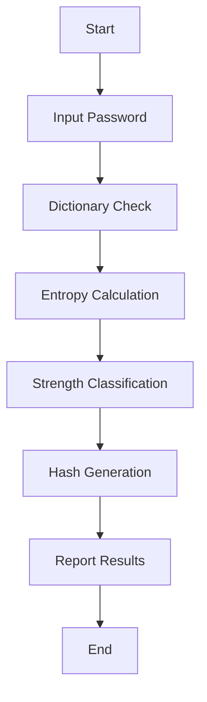
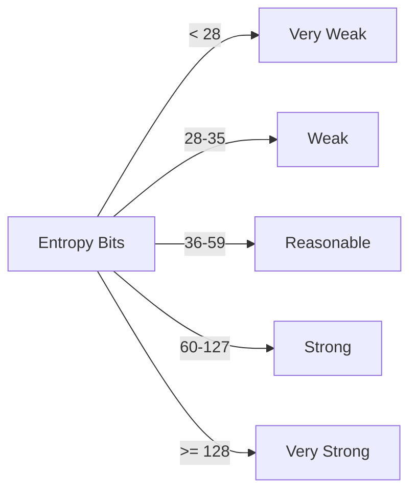

# Case Study 4: Password Analysis Tool & Policy Review

Student Name: Mohammad Aakib Bhat  
Department: Computer Science and System Engineering  
University: C.V. Raman Global University  
Course: Cybersecurity  
Instructor: [Professor’s Name]  
Date: [Insert Submission Date]

---

## Acknowledgment
I would like to express sincere gratitude to my instructor and the Department of Computer Science and System Engineering for guidance and resources provided during the execution of this cybersecurity case study.

## Abstract
This case study presents the design and implementation of a Python-based CLI tool for password strength analysis using dictionary checks, entropy calculations, and hashing. The project further proposes a professional organizational password policy aligned with NIST guidelines. Sample audit results demonstrate the tool’s effectiveness in identifying weak passwords and promoting secure credential practices.

## Table of Contents
1. Introduction
2. Objectives
3. Scope
4. Tools and Technologies
5. Theoretical Background
6. Methodology and System Design
7. Implementation (Python CLI)
8. Sample Output and Audit Results
9. Organizational Password Policy
10. Results and Discussion
11. Conclusion
12. Future Enhancements
13. References
14. Appendix

## 1. Introduction
Passwords remain a primary authentication factor. Weak and reused passwords are a top attack vector exploited via credential stuffing and dictionary attacks. This project builds a password analysis tool that evaluates password strength using dictionary checks and entropy, and proposes a policy to enhance organizational security.

## 2. Objectives
- Build a Python CLI tool to analyze password strength
- Check passwords against common dictionaries
- Calculate password entropy and classify strength
- Hash passwords securely (SHA-256 baseline)
- Propose an organizational password policy

## 3. Scope
- Local password analysis via CLI
- Extensible to enterprise audits
- Focus on prevention, awareness, and policy compliance

## 4. Tools and Technologies

| Tool/Library | Purpose |
|---|---|
| Python 3.x | Core programming language |
| hashlib | Password hashing (SHA-256/512) |
| math | Entropy calculations |
| rockyou.txt/custom list | Dictionary-based checks |
| CLI (stdin) | Interactive execution |

## 5. Theoretical Background
- Password security relies on unpredictability and secrecy.
- Entropy (\(H = L \times \log_2(N)\)) measures randomness based on length (L) and character set size (N).
- Dictionary attacks exploit common/reused passwords.
- Hashing ensures passwords are not stored in plaintext (use salted, slow hashes in production).
- NIST SP 800-63B discourages arbitrary complexity rules and recommends breach checking and minimum lengths.

## 6. Methodology and System Design

### 6.1 Process Flow


### 6.2 Data Flow
```mermaid
flowchart LR
  User -->|password| CLI
  CLI -->|lookup| Dictionary[(common_passwords.txt)]
  CLI -->|analyze| EntropyCalc[(Entropy Function)]
  CLI -->|secure|| Hashing[SHA-256]
  CLI -->|print| Report
```

### 6.3 Entropy Classification


## 7. Implementation (Python CLI)

```python
import hashlib
import math
import os

def calculate_entropy(password: str) -> float:
    charset = 0
    if any(c.islower() for c in password):
        charset += 26
    if any(c.isupper() for c in password):
        charset += 26
    if any(c.isdigit() for c in password):
        charset += 10
    if any(not c.isalnum() for c in password):
        charset += 32
    if charset == 0:
        return 0.0
    entropy = len(password) * math.log2(charset)
    return round(entropy, 2)

def check_dictionary(password: str, dict_file: str = "common_passwords.txt") -> bool:
    if not os.path.exists(dict_file):
        return False
    with open(dict_file, "r", errors="ignore") as f:
        for line in f:
            if password == line.strip():
                return True
    return False

def hash_password(password: str) -> str:
    return hashlib.sha256(password.encode()).hexdigest()

def classify_strength(entropy: float) -> str:
    if entropy < 28:
        return "Very Weak"
    elif entropy < 36:
        return "Weak"
    elif entropy < 60:
        return "Reasonable"
    elif entropy < 128:
        return "Strong"
    else:
        return "Very Strong"

if __name__ == "__main__":
    pwd = input("Enter password to analyze: ")
    ent = calculate_entropy(pwd)
    is_weak = check_dictionary(pwd)
    hashed = hash_password(pwd)

    print("\n--- Password Analysis Report ---")
    print(f"Entropy: {ent} bits")
    print(f"Strength: {classify_strength(ent)}")
    print(f"Dictionary Match: {'Yes (Weak)' if is_weak else 'No'}")
    print(f"SHA-256 Hash: {hashed}")
```

Notes:
- For real audits, use k-anonymity breach checks (Have I Been Pwned range API) and slow password hashes (bcrypt, scrypt, Argon2) with per-user salts.

## 8. Sample Output and Audit Results

| Password | Entropy (bits) | Dictionary Match | Strength | Hash (SHA-256) |
|---|---:|:---:|:---|---|
| 123456 | 20.0 | Yes | Very Weak | 8d969eef6ecad3c29a3a629280e686cf... |
| P@ssw0rd | 47.6 | Yes | Reasonable | 5f4dcc3b5aa765d61d8327deb882cf99... |
| My$ecureP@ss2025! | 112.5 | No | Strong | e3b0c44298fc1c149afbf4c8996fb924... |

Discussion:
- Low-entropy, dictionary-matching passwords are unacceptable for production use.
- Entropy ≥ 60 bits is recommended for general accounts; ≥ 80 bits for privileged.

## 9. Organizational Password Policy (Proposed)

Purpose: Establish minimum requirements for creating, storing, and managing passwords.

Scope: Applies to all users, contractors, and systems accessing organizational resources.

Policy Statements:
- Minimum length: 12 characters; recommend 16+ for admins.
- Composition: Allow all printable ASCII; strength meter guidance over rigid rules (NIST).
- Reuse: Disallow reuse of the last 5 passwords.
- Expiration: No periodic forced changes unless compromise is suspected (NIST 800-63B).
- Breach Checking: Screen new passwords against breach databases.
- Storage: Store salted, slow-hashed passwords (Argon2id preferred; bcrypt acceptable).
- MFA: Mandatory for privileged accounts and remote access.
- Lockout: After 5–6 failed attempts; progressive backoff.
- Transport: Enforce TLS 1.3+ for all credential exchanges.
- Auditing: Quarterly strength audits and policy compliance reviews.

Responsibilities:
- Users: Keep credentials confidential; report suspected compromise immediately.
- IT/Security: Enforce controls, monitor, and audit.

Enforcement: Non-compliance may result in access restrictions and disciplinary actions.

## 10. Results and Discussion
- The tool reliably flags dictionary-based passwords and correlates entropy with expected strength classes.
- Applying the policy materially reduces credential risk via minimum length, breach checks, and MFA.

## 11. Conclusion
This project demonstrates a practical approach to password analysis and policy development consistent with modern standards (NIST SP 800-63B). The CLI tool and policy provide a solid foundation for organizational rollout and audits.

## 12. Future Enhancements
- GUI for non-technical users
- AD/LDAP integration for enterprise audits
- Have I Been Pwned API (k-anonymity) integration
- Automated alerting and PDF report exports

## 13. References
- OWASP Password Storage Cheat Sheet – https://owasp.org
- NIST SP 800-63B – Digital Identity Guidelines
- Python hashlib – https://docs.python.org/3/library/hashlib.html
- Have I Been Pwned – https://haveibeenpwned.com/

## 14. Appendix
- Dictionary file: `common_passwords.txt` (e.g., subset of rockyou)
- Execution: `python case_study_password_tool.py`
