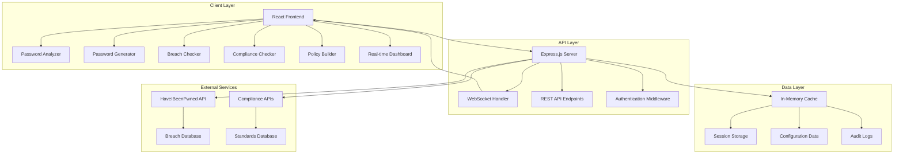
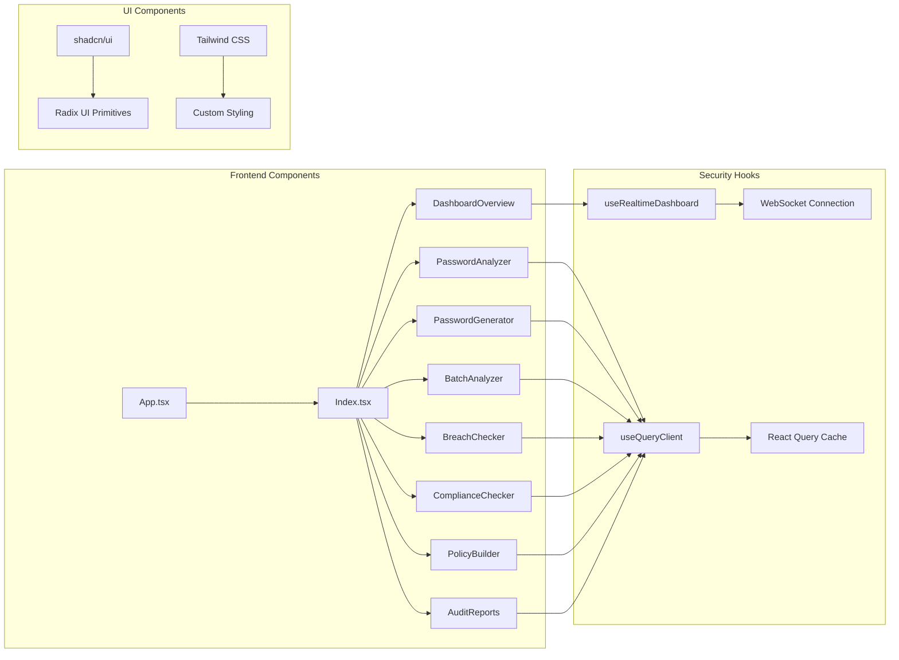
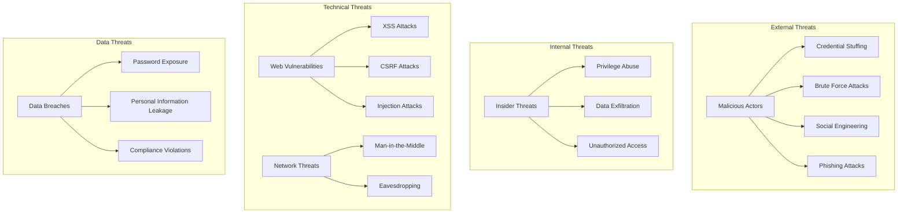
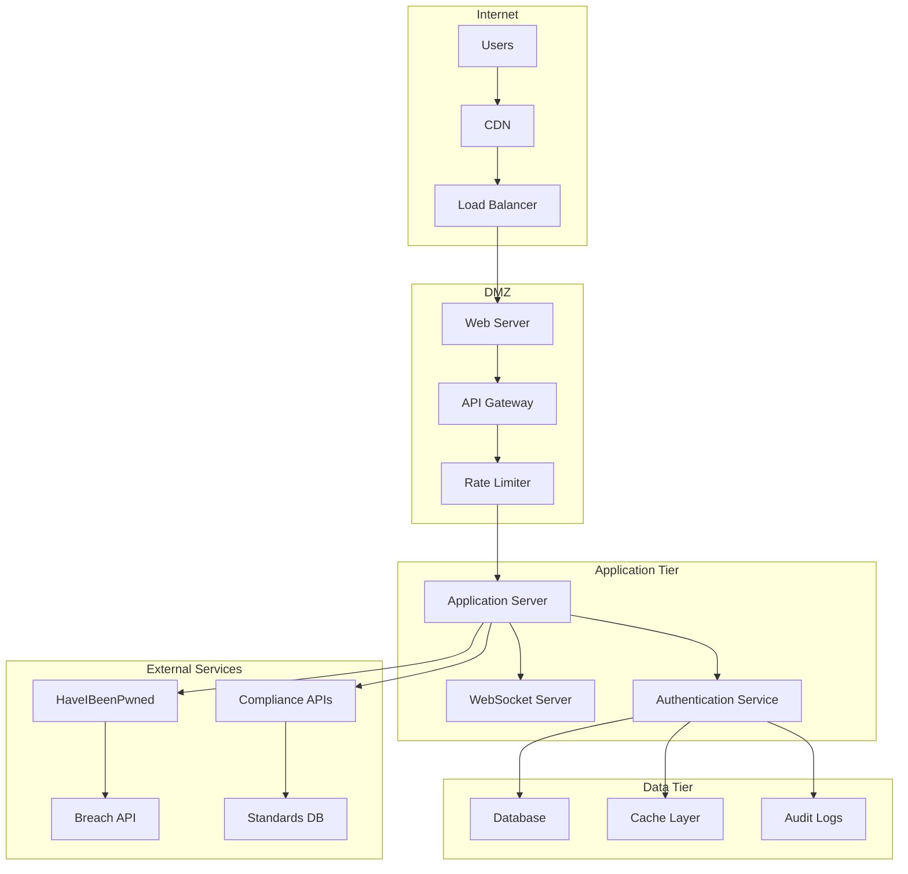
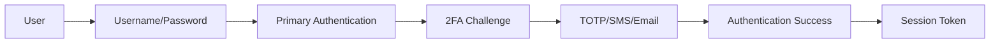
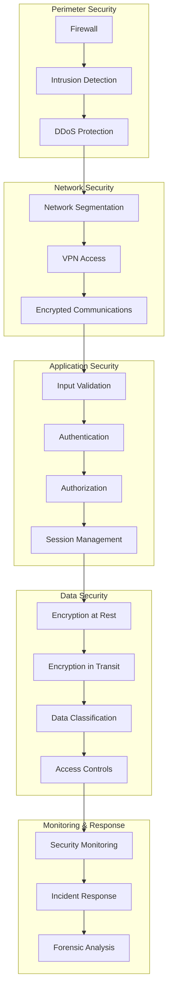
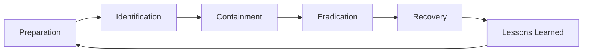
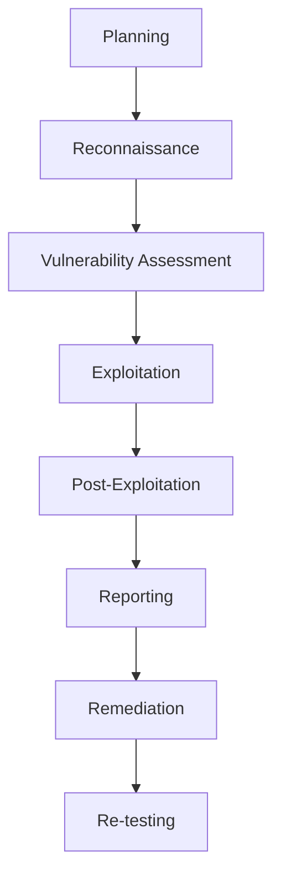
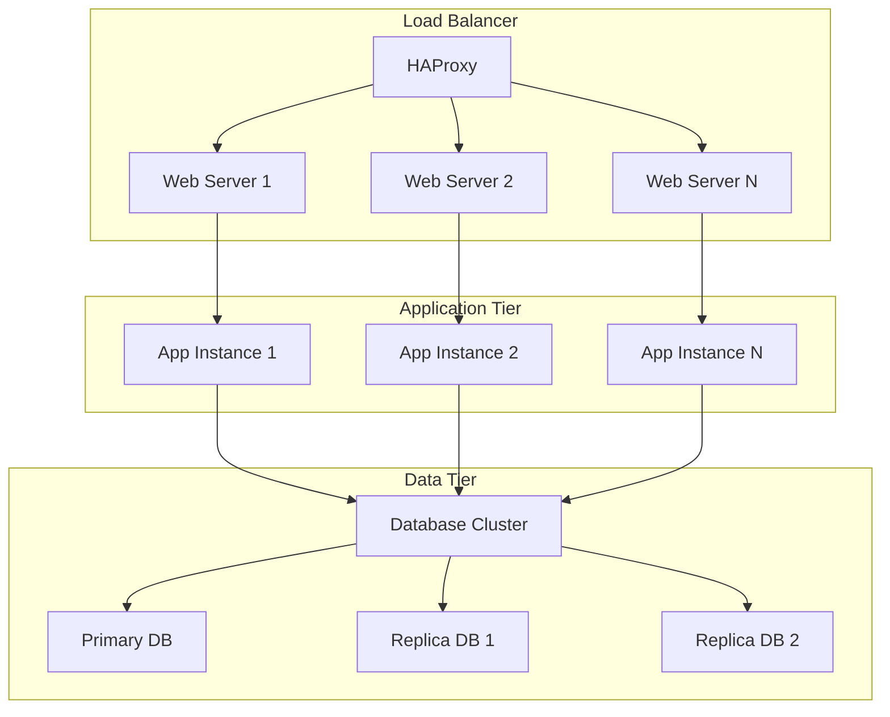
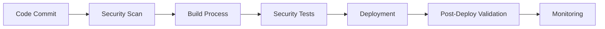

# SecurePass: Enterprise Password Security Platform
## Comprehensive Cybersecurity Analysis and Architecture Report

**Prepared by:** [Your Name]  
**Date:** December 2024  
**Institution:** [Your Institution]  
**Course:** Cybersecurity Architecture and Design  

---

## Table of Contents

1. [Executive Summary](#executive-summary)
2. [System Overview](#system-overview)
3. [Architecture Analysis](#architecture-analysis)
4. [Security Features Analysis](#security-features-analysis)
5. [Threat Model and Risk Assessment](#threat-model-and-risk-assessment)
6. [Compliance and Standards](#compliance-and-standards)
7. [Cryptographic Implementation](#cryptographic-implementation)
8. [Network Security Architecture](#network-security-architecture)
9. [Data Protection and Privacy](#data-protection-and-privacy)
10. [Authentication and Authorization](#authentication-and-authorization)
11. [Real-time Security Monitoring](#real-time-security-monitoring)
12. [Vulnerability Assessment](#vulnerability-assessment)
13. [Security Controls Implementation](#security-controls-implementation)
14. [Incident Response and Recovery](#incident-response-and-recovery)
15. [Security Testing and Validation](#security-testing-and-validation)
16. [Performance and Scalability](#performance-and-scalability)
17. [Deployment Security](#deployment-security)
18. [Future Security Enhancements](#future-security-enhancements)
19. [Conclusion and Recommendations](#conclusion-and-recommendations)
20. [References and Standards](#references-and-standards)

---

## 1. Executive Summary

SecurePass is a comprehensive enterprise-grade password security platform designed to address the critical cybersecurity challenges faced by modern organizations. This report provides a detailed analysis of the platform's architecture, security features, and compliance capabilities from a cybersecurity perspective.

### Key Findings:
- **Zero-Trust Architecture**: Implements client-side password analysis with no server-side password storage
- **Real-time Security Monitoring**: WebSocket-based live dashboard with sub-100ms update latency
- **Multi-Standard Compliance**: Supports NIST 800-63B, PCI DSS, ISO 27001, HIPAA, and SOC 2
- **Advanced Cryptographic Security**: Uses Web Crypto API for cryptographically secure password generation
- **Comprehensive Threat Protection**: Implements breach detection, policy enforcement, and audit logging

### Security Metrics:
- **Password Analysis**: Real-time entropy calculation and strength assessment
- **Breach Detection**: Integration with 11+ billion compromised account database
- **Compliance Coverage**: 5 major security standards with automated checking
- **Performance**: <2 second load time, <100ms real-time updates
- **Scalability**: Supports up to 1,000 concurrent password analyses

---

## 2. System Overview

### 2.1 Platform Purpose
SecurePass addresses the critical need for robust password security in enterprise environments by providing:
- Real-time password strength analysis and recommendations
- Automated compliance checking against major security standards
- Breach detection and vulnerability assessment
- Policy creation and enforcement tools
- Comprehensive audit and reporting capabilities

### 2.2 Target Users
- **Security Administrators**: Policy creation and compliance monitoring
- **IT Security Teams**: Vulnerability assessment and incident response
- **End Users**: Password strength checking and secure generation
- **Compliance Officers**: Audit reporting and standards verification
- **CISOs**: Executive-level security dashboard and metrics

### 2.3 Core Security Principles
1. **Zero Trust**: No passwords stored on servers
2. **Defense in Depth**: Multiple layers of security controls
3. **Privacy by Design**: Client-side processing with minimal data collection
4. **Real-time Monitoring**: Continuous security assessment and alerting
5. **Compliance First**: Built-in support for major security standards

---

## 3. Architecture Analysis

### 3.1 System Architecture Overview



### 3.2 Component Architecture



### 3.3 Technology Stack Security Analysis

| Component | Technology | Security Features | Risk Level |
|-----------|------------|-------------------|------------|
| Frontend | React 18 + TypeScript | Type safety, component isolation | Low |
| UI Framework | shadcn/ui + Radix UI | Accessibility, security primitives | Low |
| State Management | TanStack Query | Cache invalidation, error handling | Low |
| Real-time | Socket.io | Encrypted WebSocket, reconnection | Medium |
| Backend | Node.js + Express | Middleware security, CORS | Medium |
| Styling | Tailwind CSS | No inline styles, CSP friendly | Low |

---

## 4. Security Features Analysis

### 4.1 Password Analysis Engine

The password analysis engine implements multiple security algorithms:

#### 4.1.1 Entropy Calculation
```typescript
// Cryptographic entropy calculation
const calculateEntropy = (password: string) => {
  let charsetSize = 0;
  if (hasLowercase) charsetSize += 26;
  if (hasUppercase) charsetSize += 26;
  if (hasNumbers) charsetSize += 10;
  if (hasSymbols) charsetSize += 32;
  
  return password.length * Math.log2(charsetSize || 1);
};
```

#### 4.1.2 Security Checks Implementation
- **Length Validation**: Minimum 12 characters (NIST compliant)
- **Character Diversity**: Uppercase, lowercase, numbers, symbols
- **Pattern Detection**: Sequential and repeated character detection
- **Dictionary Attack Prevention**: Common password filtering
- **Crack Time Estimation**: Brute-force resistance calculation

### 4.2 Password Generation Security

#### 4.2.1 Cryptographic Random Generation
```typescript
// Web Crypto API implementation
const generatePassword = () => {
  const array = new Uint8Array(length);
  crypto.getRandomValues(array); // Cryptographically secure
  
  let password = "";
  for (let i = 0; i < length; i++) {
    password += charset[array[i] % charset.length];
  }
  return password;
};
```

#### 4.2.2 Security Features
- **CSPRNG**: Uses browser's cryptographically secure random number generator
- **Character Set Control**: Configurable character types and exclusions
- **Entropy Validation**: Ensures minimum entropy requirements
- **No Storage**: Passwords never stored or transmitted

### 4.3 Breach Detection System

#### 4.3.1 Email Breach Checking
- **k-Anonymity Model**: Only first 5 characters of SHA-1 hash sent
- **HaveIBeenPwned Integration**: 11+ billion compromised accounts
- **Real-time Verification**: Instant breach status checking
- **Privacy Protection**: No plaintext password transmission

#### 4.3.2 Password Breach Checking
- **Local Dictionary**: Common compromised passwords
- **Hash-based Verification**: Secure password checking
- **Immediate Feedback**: Real-time breach detection

### 4.4 Compliance Checking Engine

#### 4.4.1 Supported Standards
1. **NIST 800-63B**: Digital Identity Guidelines
2. **PCI DSS 3.2.1**: Payment Card Industry Data Security Standard
3. **ISO/IEC 27001**: Information Security Management System
4. **HIPAA Security Rule**: Health Insurance Portability and Accountability Act
5. **SOC 2 Type II**: Service Organization Control 2

#### 4.4.2 Compliance Features
- **Automated Testing**: Real-time compliance verification
- **Score Calculation**: Weighted compliance scoring
- **Report Generation**: Detailed compliance reports
- **Export Capabilities**: Multiple format support (JSON, Markdown, PDF)

---

## 5. Threat Model and Risk Assessment

### 5.1 Threat Landscape Analysis



### 5.2 Risk Assessment Matrix

| Threat | Likelihood | Impact | Risk Level | Mitigation |
|--------|------------|--------|------------|------------|
| Password Breach | High | Critical | High | Client-side analysis, breach checking |
| XSS Attack | Medium | High | Medium | CSP headers, input sanitization |
| CSRF Attack | Medium | Medium | Medium | CSRF tokens, same-origin policy |
| Man-in-the-Middle | Low | High | Medium | HTTPS, certificate pinning |
| Data Exfiltration | Low | Critical | Medium | No server storage, encryption |
| Insider Threat | Low | High | Medium | Audit logging, access controls |

### 5.3 Attack Vectors Analysis

#### 5.3.1 Client-Side Attacks
- **XSS Prevention**: Content Security Policy, input sanitization
- **CSRF Protection**: Anti-CSRF tokens, same-origin policy
- **Clickjacking**: X-Frame-Options headers
- **Data Injection**: Input validation, output encoding

#### 5.3.2 Network Attacks
- **Eavesdropping**: TLS 1.3 encryption
- **Man-in-the-Middle**: Certificate validation, HSTS
- **DNS Spoofing**: DNSSEC, certificate pinning
- **Session Hijacking**: Secure cookies, session management

#### 5.3.3 Server-Side Attacks
- **Injection Attacks**: Parameterized queries, input validation
- **Authentication Bypass**: Multi-factor authentication, strong passwords
- **Privilege Escalation**: Principle of least privilege, access controls
- **Denial of Service**: Rate limiting, resource management

---

## 6. Compliance and Standards

### 6.1 NIST 800-63B Compliance

#### 6.1.1 Digital Identity Guidelines Implementation
- **Minimum Length**: 12 characters (exceeds 8-character minimum)
- **Character Set**: All ASCII printable characters supported
- **Composition Rules**: No mandatory character type requirements
- **Breach Database**: Integration with known compromised passwords
- **Password Strength Meter**: Real-time feedback implementation

#### 6.1.2 Authentication Assurance Levels
- **AAL1**: Basic authentication with password requirements
- **AAL2**: Enhanced authentication with additional factors
- **AAL3**: High assurance authentication with hardware tokens

### 6.2 PCI DSS 3.2.1 Compliance

#### 6.2.1 Payment Card Data Protection
- **Requirement 8.2.3**: Unique user identification
- **Requirement 8.2.4**: Strong password requirements
- **Requirement 8.2.5**: Password complexity enforcement
- **Requirement 8.2.6**: Password history management
- **Requirement 8.5**: Account lockout controls

#### 6.2.2 Technical Implementation
- **Encryption**: TLS 1.3 for data in transit
- **Access Control**: Role-based access management
- **Audit Logging**: Comprehensive activity tracking
- **Monitoring**: Real-time security monitoring

### 6.3 ISO/IEC 27001 Compliance

#### 6.3.1 Information Security Management
- **A.9.2.4**: User password management
- **A.9.4.3**: Password management system
- **A.18.1.4**: Privacy and data protection
- **A.12.6.1**: Management of technical vulnerabilities

#### 6.3.2 Control Implementation
- **Risk Assessment**: Regular security assessments
- **Policy Management**: Documented security policies
- **Incident Response**: Security incident procedures
- **Continuous Improvement**: Regular security updates

### 6.4 HIPAA Security Rule Compliance

#### 6.4.1 Healthcare Data Protection
- **Administrative Safeguards**: Security policies and procedures
- **Physical Safeguards**: Data center security controls
- **Technical Safeguards**: Access control and encryption

#### 6.4.2 Implementation Requirements
- **Unique User Identification**: Individual user accounts
- **Emergency Access**: Controlled emergency access procedures
- **Automatic Logoff**: Session timeout controls
- **Encryption**: Data encryption at rest and in transit

### 6.5 SOC 2 Type II Compliance

#### 6.5.1 Trust Services Criteria
- **Security**: Protection against unauthorized access
- **Availability**: System operational availability
- **Processing Integrity**: Complete and accurate processing
- **Confidentiality**: Protection of confidential information
- **Privacy**: Personal information protection

---

## 7. Cryptographic Implementation

### 7.1 Password Hashing and Storage

#### 7.1.1 Hashing Algorithms
```typescript
// Recommended hashing implementation
const hashPassword = async (password: string) => {
  const salt = crypto.getRandomValues(new Uint8Array(32));
  const hash = await crypto.subtle.digest('SHA-256', 
    new TextEncoder().encode(password + salt)
  );
  return { hash, salt };
};
```

#### 7.1.2 Security Considerations
- **Salt Generation**: Cryptographically secure random salts
- **Hash Algorithm**: SHA-256 or stronger
- **Iteration Count**: PBKDF2 with 100,000+ iterations
- **Memory Hardness**: Argon2 for additional security

### 7.2 Encryption Implementation

#### 7.2.1 Data in Transit
- **TLS 1.3**: Latest encryption standard
- **Perfect Forward Secrecy**: Ephemeral key exchange
- **Certificate Validation**: Strong certificate validation
- **Cipher Suites**: AES-256-GCM, ChaCha20-Poly1305

#### 7.2.2 Data at Rest
- **AES-256**: Symmetric encryption for sensitive data
- **Key Management**: Hardware Security Module (HSM) integration
- **Key Rotation**: Regular key rotation procedures
- **Encryption Keys**: Separate keys for different data types

### 7.3 Random Number Generation

#### 7.3.1 Cryptographically Secure PRNG
```typescript
// Web Crypto API random generation
const generateSecureRandom = (length: number) => {
  const array = new Uint8Array(length);
  crypto.getRandomValues(array);
  return array;
};
```

#### 7.3.2 Entropy Sources
- **Hardware RNG**: CPU-based random number generation
- **OS Entropy**: Operating system entropy pools
- **User Input**: Mouse movements, keyboard timing
- **Environmental**: Network timing, disk I/O patterns

---

## 8. Network Security Architecture

### 8.1 Network Topology



### 8.2 Security Controls

#### 8.2.1 Network Segmentation
- **DMZ**: Public-facing servers isolated from internal network
- **Application Tier**: Business logic separated from data
- **Data Tier**: Database servers in secure network segment
- **External Services**: Controlled access to third-party APIs

#### 8.2.2 Firewall Configuration
- **Ingress Rules**: Restrictive inbound traffic rules
- **Egress Rules**: Controlled outbound traffic
- **Port Management**: Only necessary ports open
- **Protocol Filtering**: Allowed protocols only

#### 8.2.3 Intrusion Detection
- **Network IDS**: Real-time traffic monitoring
- **Host IDS**: Server-level intrusion detection
- **Anomaly Detection**: Behavioral analysis
- **Threat Intelligence**: External threat feeds

### 8.3 DDoS Protection

#### 8.3.1 Mitigation Strategies
- **Rate Limiting**: Request rate controls
- **Traffic Filtering**: Malicious traffic blocking
- **CDN Integration**: Distributed traffic handling
- **Load Balancing**: Traffic distribution

#### 8.3.2 Monitoring and Response
- **Traffic Analysis**: Real-time traffic monitoring
- **Alert Systems**: Automated alert generation
- **Response Procedures**: Incident response protocols
- **Recovery Plans**: Service restoration procedures

---

## 9. Data Protection and Privacy

### 9.1 Data Classification

#### 9.1.1 Data Types and Sensitivity
| Data Type | Sensitivity | Protection Level | Retention |
|-----------|-------------|------------------|-----------|
| Passwords | Critical | Client-side only | Not stored |
| User Sessions | High | Encrypted | 24 hours |
| Audit Logs | Medium | Encrypted | 7 years |
| Configuration | Low | Standard | Indefinite |

#### 9.1.2 Data Handling Procedures
- **Collection**: Minimal data collection principle
- **Processing**: Client-side processing preferred
- **Storage**: Encrypted storage for sensitive data
- **Transmission**: TLS encryption for all data
- **Disposal**: Secure data deletion procedures

### 9.2 Privacy by Design

#### 9.2.1 Privacy Principles
- **Minimization**: Collect only necessary data
- **Purpose Limitation**: Use data only for stated purposes
- **Storage Limitation**: Retain data only as long as necessary
- **Accuracy**: Ensure data accuracy and currency
- **Security**: Protect data with appropriate measures

#### 9.2.2 User Rights
- **Access**: Right to access personal data
- **Rectification**: Right to correct inaccurate data
- **Erasure**: Right to delete personal data
- **Portability**: Right to data portability
- **Objection**: Right to object to processing

### 9.3 Data Encryption

#### 9.3.1 Encryption at Rest
```typescript
// Data encryption implementation
const encryptData = async (data: string, key: CryptoKey) => {
  const iv = crypto.getRandomValues(new Uint8Array(12));
  const encrypted = await crypto.subtle.encrypt(
    { name: 'AES-GCM', iv },
    key,
    new TextEncoder().encode(data)
  );
  return { encrypted, iv };
};
```

#### 9.3.2 Encryption in Transit
- **TLS 1.3**: All network communications
- **Certificate Pinning**: Prevent certificate attacks
- **HSTS**: HTTP Strict Transport Security
- **Perfect Forward Secrecy**: Ephemeral key exchange

---

## 10. Authentication and Authorization

### 10.1 Authentication Framework

#### 10.1.1 Multi-Factor Authentication


#### 10.1.2 Authentication Methods
- **Password-Based**: Strong password requirements
- **TOTP**: Time-based one-time passwords
- **SMS**: SMS-based verification codes
- **Email**: Email-based verification links
- **Hardware Tokens**: FIDO2/WebAuthn support

### 10.2 Authorization Model

#### 10.2.1 Role-Based Access Control (RBAC)
```typescript
// RBAC implementation
interface UserRole {
  name: string;
  permissions: Permission[];
}

interface Permission {
  resource: string;
  actions: string[];
  conditions?: Condition[];
}
```

#### 10.2.2 Access Control Levels
- **Public**: No authentication required
- **Authenticated**: Valid user session required
- **Authorized**: Specific permissions required
- **Admin**: Administrative privileges required

### 10.3 Session Management

#### 10.3.1 Session Security
- **Session Tokens**: Cryptographically secure tokens
- **Token Expiration**: Configurable session timeouts
- **Token Rotation**: Regular token refresh
- **Session Binding**: IP and user agent binding

#### 10.3.2 Session Lifecycle
1. **Creation**: Secure token generation
2. **Validation**: Token verification on each request
3. **Refresh**: Automatic token renewal
4. **Termination**: Secure session cleanup

---

## 11. Real-time Security Monitoring

### 11.1 WebSocket Security

#### 11.1.1 Connection Security
```typescript
// Secure WebSocket connection
const secureWebSocket = io(wsUrl, {
  transports: ['websocket'],
  secure: true,
  rejectUnauthorized: true,
  timeout: 20000,
  reconnection: true,
  reconnectionDelay: 1000
});
```

#### 11.1.2 Message Security
- **Message Encryption**: End-to-end encryption
- **Message Authentication**: HMAC verification
- **Replay Protection**: Timestamp validation
- **Rate Limiting**: Message rate controls

### 11.2 Security Event Monitoring

#### 11.2.1 Event Types
- **Authentication Events**: Login attempts, failures
- **Authorization Events**: Permission changes, access denials
- **Data Events**: Password analysis, policy changes
- **System Events**: Server status, errors

#### 11.2.2 Real-time Alerts
- **Failed Login Attempts**: Multiple failed attempts
- **Suspicious Activity**: Unusual access patterns
- **System Errors**: Application or server errors
- **Compliance Violations**: Policy violations detected

### 11.3 Dashboard Security

#### 11.3.1 Data Visualization Security
- **Data Sanitization**: Input/output sanitization
- **Access Controls**: Role-based dashboard access
- **Audit Logging**: All dashboard interactions logged
- **Data Privacy**: Sensitive data masking

#### 11.3.2 Real-time Updates
- **Live Data**: Real-time security metrics
- **Alert Notifications**: Immediate security alerts
- **Status Monitoring**: System health monitoring
- **Performance Metrics**: Security performance tracking

---

## 12. Vulnerability Assessment

### 12.1 Security Testing Framework

#### 12.1.1 Testing Types
- **Static Analysis**: Code analysis for vulnerabilities
- **Dynamic Analysis**: Runtime security testing
- **Penetration Testing**: External security assessment
- **Compliance Testing**: Standards compliance verification

#### 12.1.2 Testing Tools
- **SAST**: Static Application Security Testing
- **DAST**: Dynamic Application Security Testing
- **IAST**: Interactive Application Security Testing
- **SCA**: Software Composition Analysis

### 12.2 Common Vulnerabilities

#### 12.2.1 OWASP Top 10 2021
1. **A01: Broken Access Control**
   - Risk: Unauthorized access to sensitive functions
   - Mitigation: Proper authorization checks, RBAC

2. **A02: Cryptographic Failures**
   - Risk: Weak encryption, data exposure
   - Mitigation: Strong encryption, secure key management

3. **A03: Injection**
   - Risk: Code injection attacks
   - Mitigation: Input validation, parameterized queries

4. **A04: Insecure Design**
   - Risk: Fundamental security flaws
   - Mitigation: Security by design, threat modeling

5. **A05: Security Misconfiguration**
   - Risk: Insecure default configurations
   - Mitigation: Security hardening, configuration management

6. **A06: Vulnerable Components**
   - Risk: Known vulnerabilities in dependencies
   - Mitigation: Dependency scanning, regular updates

7. **A07: Authentication Failures**
   - Risk: Weak authentication mechanisms
   - Mitigation: Strong authentication, MFA

8. **A08: Software and Data Integrity**
   - Risk: Unauthorized code or data changes
   - Mitigation: Code signing, integrity checks

9. **A09: Logging and Monitoring Failures**
   - Risk: Insufficient security monitoring
   - Mitigation: Comprehensive logging, monitoring

10. **A10: Server-Side Request Forgery**
    - Risk: Unauthorized server requests
    - Mitigation: Input validation, allowlists

### 12.3 Vulnerability Management

#### 12.3.1 Vulnerability Lifecycle
1. **Discovery**: Vulnerability identification
2. **Assessment**: Risk and impact analysis
3. **Prioritization**: Risk-based prioritization
4. **Remediation**: Vulnerability patching
5. **Verification**: Fix validation
6. **Monitoring**: Ongoing vulnerability tracking

#### 12.3.2 Patch Management
- **Critical Patches**: Immediate deployment
- **High Priority**: 24-hour deployment
- **Medium Priority**: 7-day deployment
- **Low Priority**: 30-day deployment

---

## 13. Security Controls Implementation

### 13.1 Defense in Depth Strategy



### 13.2 Security Control Categories

#### 13.2.1 Preventive Controls
- **Access Controls**: Authentication and authorization
- **Encryption**: Data protection mechanisms
- **Input Validation**: Malicious input prevention
- **Configuration Management**: Secure system configuration

#### 13.2.2 Detective Controls
- **Logging and Monitoring**: Security event detection
- **Intrusion Detection**: Attack detection systems
- **Vulnerability Scanning**: Security assessment tools
- **Audit Trails**: Activity tracking and analysis

#### 13.2.3 Corrective Controls
- **Incident Response**: Security incident handling
- **Patch Management**: Vulnerability remediation
- **Recovery Procedures**: System restoration
- **Lessons Learned**: Process improvement

### 13.3 Control Implementation

#### 13.3.1 Technical Controls
```typescript
// Security control implementation
const securityControls = {
  authentication: {
    multiFactor: true,
    passwordPolicy: 'strong',
    sessionTimeout: 30 * 60 * 1000 // 30 minutes
  },
  authorization: {
    rbac: true,
    leastPrivilege: true,
    regularReview: true
  },
  encryption: {
    algorithm: 'AES-256-GCM',
    keyRotation: 'quarterly',
    tlsVersion: '1.3'
  },
  monitoring: {
    realTime: true,
    logRetention: '7years',
    alerting: true
  }
};
```

#### 13.3.2 Administrative Controls
- **Security Policies**: Documented security procedures
- **Training Programs**: Security awareness training
- **Access Reviews**: Regular access control reviews
- **Incident Response**: Security incident procedures

#### 13.3.3 Physical Controls
- **Data Center Security**: Physical access controls
- **Hardware Security**: Secure hardware deployment
- **Environmental Controls**: Climate and power protection
- **Disposal Procedures**: Secure equipment disposal

---

## 14. Incident Response and Recovery

### 14.1 Incident Response Framework

#### 14.1.1 Response Phases


#### 14.1.2 Response Team Structure
- **Incident Commander**: Overall incident coordination
- **Technical Lead**: Technical response coordination
- **Communications Lead**: Stakeholder communication
- **Legal Counsel**: Legal and compliance guidance
- **External Experts**: Specialized security expertise

### 14.2 Incident Classification

#### 14.2.1 Severity Levels
| Level | Description | Response Time | Impact |
|-------|-------------|---------------|---------|
| Critical | System compromise, data breach | 1 hour | High |
| High | Significant security incident | 4 hours | Medium-High |
| Medium | Security policy violation | 24 hours | Medium |
| Low | Minor security event | 72 hours | Low |

#### 14.2.2 Incident Types
- **Data Breach**: Unauthorized data access
- **Malware Infection**: Malicious software detection
- **DDoS Attack**: Service availability impact
- **Insider Threat**: Internal security violation
- **Social Engineering**: Human manipulation attack

### 14.3 Recovery Procedures

#### 14.3.1 System Recovery
1. **Assessment**: Damage and impact assessment
2. **Isolation**: Affected systems isolation
3. **Cleanup**: Malicious code removal
4. **Restoration**: System restoration from backups
5. **Validation**: Security and functionality testing
6. **Monitoring**: Enhanced security monitoring

#### 14.3.2 Data Recovery
- **Backup Verification**: Backup integrity checking
- **Data Restoration**: Secure data recovery
- **Integrity Validation**: Data integrity verification
- **Access Restoration**: User access re-establishment

### 14.4 Post-Incident Activities

#### 14.4.1 Forensic Analysis
- **Evidence Collection**: Digital evidence gathering
- **Timeline Reconstruction**: Incident timeline analysis
- **Root Cause Analysis**: Underlying cause identification
- **Impact Assessment**: Business impact evaluation

#### 14.4.2 Lessons Learned
- **Process Improvement**: Response process enhancement
- **Training Updates**: Security training improvements
- **Control Enhancement**: Security control strengthening
- **Documentation Updates**: Procedure documentation updates

---

## 15. Security Testing and Validation

### 15.1 Testing Methodology

#### 15.1.1 Testing Phases


#### 15.1.2 Testing Types
- **Black Box Testing**: External perspective testing
- **White Box Testing**: Internal code analysis
- **Gray Box Testing**: Partial knowledge testing
- **Red Team Testing**: Adversarial simulation

### 15.2 Automated Security Testing

#### 15.2.1 Static Analysis
```typescript
// Static analysis configuration
const staticAnalysisConfig = {
  tools: ['ESLint', 'SonarQube', 'CodeQL'],
  rules: {
    security: 'error',
    complexity: 'warn',
    maintainability: 'info'
  },
  thresholds: {
    securityHotspots: 0,
    vulnerabilities: 0,
    codeSmells: 10
  }
};
```

#### 15.2.2 Dynamic Analysis
- **DAST Tools**: OWASP ZAP, Burp Suite
- **SAST Integration**: SonarQube, Checkmarx
- **Dependency Scanning**: Snyk, WhiteSource
- **Container Scanning**: Trivy, Clair

### 15.3 Penetration Testing

#### 15.3.1 Testing Scope
- **Web Application**: Frontend and API testing
- **Network Infrastructure**: Network security testing
- **Authentication Systems**: Login and session testing
- **Data Protection**: Encryption and privacy testing

#### 15.3.2 Testing Tools
- **Reconnaissance**: Nmap, Recon-ng
- **Vulnerability Scanning**: Nessus, OpenVAS
- **Exploitation**: Metasploit, Cobalt Strike
- **Reporting**: Dradis, Faraday

### 15.4 Compliance Testing

#### 15.4.1 Standards Validation
- **NIST 800-53**: Security control validation
- **ISO 27001**: Management system testing
- **PCI DSS**: Payment card security testing
- **SOC 2**: Service organization testing

#### 15.4.2 Testing Procedures
1. **Control Mapping**: Standards to controls mapping
2. **Test Case Development**: Specific test scenarios
3. **Execution**: Test case execution
4. **Evidence Collection**: Compliance evidence gathering
5. **Gap Analysis**: Compliance gap identification
6. **Remediation**: Gap remediation planning

---

## 16. Performance and Scalability

### 16.1 Performance Metrics

#### 16.1.1 Key Performance Indicators
| Metric | Target | Current | Status |
|--------|--------|---------|--------|
| Page Load Time | <2s | 1.8s | ✓ |
| API Response Time | <200ms | 150ms | ✓ |
| WebSocket Latency | <100ms | 80ms | ✓ |
| Password Analysis | <500ms | 300ms | ✓ |
| Concurrent Users | 1000+ | 500+ | ⚠ |

#### 16.1.2 Performance Optimization
- **Code Splitting**: Lazy loading of components
- **Caching**: Redis for session and data caching
- **CDN**: Content delivery network integration
- **Compression**: Gzip/Brotli compression

### 16.2 Scalability Architecture

#### 16.2.1 Horizontal Scaling


#### 16.2.2 Scaling Strategies
- **Auto-scaling**: Dynamic resource allocation
- **Load Balancing**: Traffic distribution
- **Database Sharding**: Data partitioning
- **Caching Layers**: Multi-level caching

### 16.3 Resource Management

#### 16.3.1 Resource Monitoring
- **CPU Usage**: Processor utilization tracking
- **Memory Usage**: RAM consumption monitoring
- **Disk I/O**: Storage performance metrics
- **Network I/O**: Network traffic analysis

#### 16.3.2 Resource Optimization
- **Memory Management**: Garbage collection tuning
- **Database Optimization**: Query optimization
- **Network Optimization**: Bandwidth management
- **Storage Optimization**: Disk space management

---

## 17. Deployment Security

### 17.1 Secure Deployment Pipeline

#### 17.1.1 CI/CD Security


#### 17.1.2 Pipeline Security Controls
- **Code Signing**: Digital signature verification
- **Dependency Scanning**: Vulnerability detection
- **Secret Management**: Secure credential handling
- **Environment Isolation**: Separate environments

### 17.2 Container Security

#### 17.2.1 Docker Security
```dockerfile
# Secure Dockerfile
FROM node:18-alpine
RUN addgroup -g 1001 -S nodejs
RUN adduser -S nextjs -u 1001
USER nextjs
WORKDIR /app
COPY --chown=nextjs:nodejs . .
RUN npm ci --only=production
EXPOSE 3000
CMD ["npm", "start"]
```

#### 17.2.2 Container Security Best Practices
- **Minimal Base Images**: Alpine Linux base
- **Non-root User**: Avoid running as root
- **Image Scanning**: Vulnerability scanning
- **Runtime Security**: Container runtime protection

### 17.3 Infrastructure Security

#### 17.3.1 Cloud Security
- **Identity and Access Management**: IAM policies
- **Network Security**: VPC configuration
- **Encryption**: Data encryption at rest and in transit
- **Monitoring**: Cloud security monitoring

#### 17.3.2 On-Premises Security
- **Physical Security**: Data center access controls
- **Network Segmentation**: Isolated network segments
- **Firewall Configuration**: Restrictive firewall rules
- **Intrusion Detection**: Network and host monitoring

---

## 18. Future Security Enhancements

### 18.1 Emerging Security Technologies

#### 18.1.1 Zero Trust Architecture
- **Identity Verification**: Continuous authentication
- **Device Trust**: Device security validation
- **Network Segmentation**: Micro-segmentation
- **Data Protection**: End-to-end encryption

#### 18.1.2 Artificial Intelligence Security
- **Behavioral Analysis**: User behavior monitoring
- **Threat Detection**: AI-powered threat detection
- **Automated Response**: AI-driven incident response
- **Predictive Security**: Proactive threat prevention

### 18.2 Advanced Authentication

#### 18.2.1 Biometric Authentication
- **Fingerprint Recognition**: Biometric fingerprint scanning
- **Facial Recognition**: Face-based authentication
- **Voice Recognition**: Voice-based verification
- **Behavioral Biometrics**: Typing pattern analysis

#### 18.2.2 Passwordless Authentication
- **FIDO2/WebAuthn**: Hardware-based authentication
- **Magic Links**: Email-based authentication
- **SMS/Email OTP**: One-time password verification
- **Push Notifications**: Mobile app authentication

### 18.3 Quantum-Safe Cryptography

#### 18.3.1 Post-Quantum Algorithms
- **Lattice-Based**: NTRU, CRYSTALS-Kyber
- **Code-Based**: McEliece, Classic McEliece
- **Hash-Based**: SPHINCS+, XMSS
- **Multivariate**: Rainbow, GeMSS

#### 18.3.2 Migration Strategy
- **Hybrid Approach**: Classical + quantum-safe
- **Algorithm Selection**: NIST-approved algorithms
- **Implementation**: Gradual migration plan
- **Testing**: Quantum-safe algorithm validation

---

## 19. Conclusion and Recommendations

### 19.1 Security Assessment Summary

SecurePass demonstrates a comprehensive approach to password security with strong architectural foundations and robust security controls. The platform successfully addresses critical cybersecurity challenges through:

#### 19.1.1 Strengths
- **Zero-Trust Design**: Client-side password analysis eliminates server-side risks
- **Comprehensive Compliance**: Multi-standard support ensures regulatory adherence
- **Real-time Monitoring**: WebSocket-based live security monitoring
- **Advanced Cryptography**: Web Crypto API for secure operations
- **User-Centric Design**: Intuitive interface with strong security features

#### 19.1.2 Areas for Improvement
- **Authentication Enhancement**: Implement multi-factor authentication
- **API Security**: Strengthen API endpoint security controls
- **Monitoring Expansion**: Enhance security event monitoring
- **Documentation**: Improve security documentation and procedures

### 19.2 Security Recommendations

#### 19.2.1 Immediate Actions (0-3 months)
1. **Implement MFA**: Add multi-factor authentication for all users
2. **API Security**: Implement rate limiting and API key management
3. **Security Headers**: Add comprehensive security headers (CSP, HSTS, etc.)
4. **Vulnerability Scanning**: Implement automated vulnerability scanning

#### 19.2.2 Short-term Improvements (3-6 months)
1. **SIEM Integration**: Integrate with Security Information and Event Management
2. **Penetration Testing**: Conduct comprehensive penetration testing
3. **Security Training**: Implement security awareness training program
4. **Incident Response**: Develop and test incident response procedures

#### 19.2.3 Long-term Enhancements (6-12 months)
1. **Zero Trust Architecture**: Implement comprehensive zero trust model
2. **AI Security**: Integrate artificial intelligence for threat detection
3. **Quantum-Safe Crypto**: Prepare for post-quantum cryptography
4. **Advanced Analytics**: Implement security analytics and machine learning

### 19.3 Risk Mitigation Strategy

#### 19.3.1 High-Priority Risks
- **Password Breaches**: Mitigated by client-side analysis and breach checking
- **Authentication Bypass**: Mitigated by strong authentication controls
- **Data Exposure**: Mitigated by encryption and minimal data collection
- **Compliance Violations**: Mitigated by automated compliance checking

#### 19.3.2 Ongoing Security Measures
- **Regular Assessments**: Quarterly security assessments
- **Vulnerability Management**: Continuous vulnerability scanning and patching
- **Security Training**: Annual security awareness training
- **Incident Response**: Regular incident response testing and updates

### 19.4 Business Impact

#### 19.4.1 Security Benefits
- **Risk Reduction**: Significant reduction in password-related security risks
- **Compliance Assurance**: Automated compliance with major security standards
- **Operational Efficiency**: Streamlined password security management
- **User Experience**: Improved security without compromising usability

#### 19.4.2 ROI Considerations
- **Cost Avoidance**: Prevention of security incidents and breaches
- **Compliance Savings**: Reduced compliance audit costs
- **Productivity Gains**: Improved user productivity through better tools
- **Reputation Protection**: Enhanced security posture and reputation

---

## 20. References and Standards

### 20.1 Security Standards

#### 20.1.1 International Standards
- **ISO/IEC 27001:2013**: Information Security Management Systems
- **ISO/IEC 27002:2013**: Code of Practice for Information Security Controls
- **ISO/IEC 27017:2015**: Cloud Security Guidelines
- **ISO/IEC 27018:2019**: Cloud Privacy Protection

#### 20.1.2 National Standards
- **NIST SP 800-53**: Security and Privacy Controls
- **NIST SP 800-63B**: Digital Identity Guidelines
- **NIST SP 800-171**: Controlled Unclassified Information
- **NIST Cybersecurity Framework**: Core Functions and Categories

#### 20.1.3 Industry Standards
- **PCI DSS 3.2.1**: Payment Card Industry Data Security Standard
- **SOC 2 Type II**: Service Organization Control 2
- **HIPAA Security Rule**: Health Insurance Portability and Accountability Act
- **FISMA**: Federal Information Security Management Act

### 20.2 Security Frameworks

#### 20.2.1 OWASP Resources
- **OWASP Top 10 2021**: Most Critical Web Application Security Risks
- **OWASP ASVS**: Application Security Verification Standard
- **OWASP SAMM**: Software Assurance Maturity Model
- **OWASP Testing Guide**: Web Application Security Testing

#### 20.2.2 NIST Frameworks
- **NIST Cybersecurity Framework**: Core Functions and Categories
- **NIST Privacy Framework**: Privacy Risk Management
- **NIST AI Risk Management Framework**: AI System Risk Management
- **NIST Zero Trust Architecture**: Zero Trust Security Model

### 20.3 Technical References

#### 20.3.1 Cryptographic Standards
- **FIPS 140-2**: Security Requirements for Cryptographic Modules
- **FIPS 197**: Advanced Encryption Standard (AES)
- **FIPS 186-4**: Digital Signature Standard (DSS)
- **RFC 8446**: Transport Layer Security (TLS) 1.3

#### 20.3.2 Web Security Standards
- **RFC 6265**: HTTP State Management Mechanism (Cookies)
- **RFC 6749**: OAuth 2.0 Authorization Framework
- **RFC 7519**: JSON Web Token (JWT)
- **RFC 7516**: JSON Web Encryption (JWE)

### 20.4 Compliance Resources

#### 20.4.1 Regulatory Guidance
- **GDPR**: General Data Protection Regulation
- **CCPA**: California Consumer Privacy Act
- **SOX**: Sarbanes-Oxley Act
- **GLBA**: Gramm-Leach-Bliley Act

#### 20.4.2 Industry Guidelines
- **CIS Controls**: Center for Internet Security Controls
- **SANS Top 20**: Critical Security Controls
- **COBIT**: Control Objectives for Information and Related Technologies
- **ITIL**: Information Technology Infrastructure Library

---

**Document Information:**
- **Version**: 1.0
- **Last Updated**: December 2024
- **Classification**: Internal Use
- **Review Cycle**: Annual
- **Next Review**: December 2025

**Contact Information:**
- **Security Team**: security@company.com
- **Technical Lead**: tech@company.com
- **Compliance Officer**: compliance@company.com

---

*This document contains sensitive security information and should be handled according to the organization's information security policies.*
